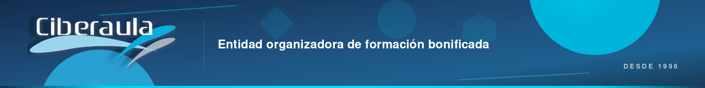

---

# Plantilla: Registro de sistemas de IA en la empresa

> **Resumen:** Plantilla completa para documentar el inventario de sistemas de IA que utiliza tu empresa, con todos los campos necesarios para cumplir el AI Act y para responder a una inspección de AESIA o AEPD. Incluye 15 campos por sistema, clasificación de riesgo guiada y bloque de trazabilidad de cambios. Lista para copiar a Excel o Google Sheets.

**Tipo de documento:** Plantilla editable para inventario de sistemas IA
**Autora:** Ana María González · Directora de CiberAula
**Licencia:** CC BY-SA 4.0

---

## ¿Por qué necesitas este registro?

El AI Act exige en la práctica que cualquier empresa que use sistemas IA sepa **qué sistemas usa, para qué, con qué datos y qué nivel de riesgo tienen**. Sin un inventario:

- No puedes clasificar los sistemas por nivel de riesgo (obligación crítica).
- No puedes formar al personal adaptadamente (artículo 4).
- No puedes responder a una inspección (ni de AESIA ni de AEPD).
- No puedes ejercer control de gobernanza sobre su uso.

Este registro es por tanto **la piedra angular del cumplimiento**. Sin él, todo lo demás se derrumba.

---

## Cómo usar esta plantilla

1. **Copia la tabla de la sección 3** a una hoja de cálculo (Excel, Google Sheets, Numbers).
2. **Rellena una fila por cada sistema IA** identificado en tu empresa.
3. **Incluye también sistemas que se integren** dentro de otras herramientas (IA embebida en CRM, ERP, correo, etc.).
4. **No olvides el "shadow AI"**: uso por parte de empleados con cuentas personales.
5. **Actualiza trimestralmente** como mínimo. Cada vez que se incorpora o se retira un sistema.
6. **Mantén las versiones históricas** del registro (no sobrescribas — conserva las versiones anteriores).
7. **Comparte el registro** con los responsables de departamento para que ellos verifiquen su exactitud.

---

## Campos del registro

Para cada sistema IA, documenta los siguientes 15 campos:

### Identificación

1. **ID interno**: código único que asignas a este sistema dentro de tu empresa (ej: IA-001, IA-002). Permite referenciarlo en otros documentos.
2. **Nombre comercial**: nombre del producto/servicio (ej: ChatGPT Team, Claude for Work, Gemini Advanced).
3. **Proveedor**: empresa que proporciona el sistema (ej: OpenAI, Anthropic, Google, Microsoft).

### Uso en la empresa

4. **Finalidad de uso**: para qué se utiliza en la empresa. Sé específico (ej: "redacción de borradores de contratos", "análisis de CVs en preselección", "generación de respuestas en chat de atención al cliente").
5. **Departamentos que lo usan**: lista de áreas de la empresa con acceso al sistema.
6. **Número de usuarios autorizados**: cuántas personas tienen acceso activo.
7. **Fecha de inicio de uso** en la empresa.

### Datos tratados

8. **Tipos de datos introducidos**: qué tipo de información se mete en el sistema (datos personales de clientes, datos financieros, datos de empleados, documentos internos, información pública, etc.).
9. **¿Hay datos personales?** Sí / No. Si sí, cuáles y en qué volumen aproximado.
10. **¿Está contractualmente garantizado el no-entrenamiento sobre tus datos?** Sí / No. Documento de referencia en el contrato.

### Clasificación AI Act

11. **Nivel de riesgo AI Act**:
    - **Inaceptable (prohibido)** — retirar inmediatamente.
    - **Alto riesgo** — selección personal, credit scoring, educación, infraestructura crítica. Obligaciones completas desde agosto 2026.
    - **Riesgo limitado** — chatbots, contenido generativo para público. Transparencia obligatoria.
    - **Riesgo mínimo** — productividad general, redacción, análisis sin impacto crítico.

12. **Justificación de la clasificación**: breve explicación del criterio aplicado.

### Gobernanza

13. **Responsable interno**: persona o departamento responsable del uso correcto de este sistema.
14. **Política de uso aplicable**: referencia al documento interno que regula su uso (ej: Política de uso de IA v1.0, anexo B).
15. **Fecha de última revisión** de este registro para este sistema.

---

## Tabla plantilla (copiar a Excel/Google Sheets)

| ID | Nombre | Proveedor | Finalidad | Departamentos | Usuarios | Inicio | Datos tratados | ¿Personales? | ¿No-entrenamiento? | Riesgo AI Act | Justificación | Responsable | Política | Última revisión |
|---|---|---|---|---|---|---|---|---|---|---|---|---|---|---|
| IA-001 | | | | | | | | | | | | | | |
| IA-002 | | | | | | | | | | | | | | |

---

## Ejemplo cumplimentado (empresa ficticia, 30 empleados)

A continuación, un ejemplo realista de cómo queda el registro en una empresa mediana española.

### IA-001 · ChatGPT Team

| Campo | Valor |
|---|---|
| **Nombre** | ChatGPT Team |
| **Proveedor** | OpenAI |
| **Finalidad** | Redacción de emails, borradores de informes, traducciones, resúmenes, búsqueda de información general |
| **Departamentos** | Marketing, Comercial, Administración |
| **Usuarios** | 18 |
| **Inicio** | Marzo 2025 |
| **Datos tratados** | Textos genéricos, correos electrónicos, información pública |
| **¿Datos personales?** | No de forma sistemática (política interna lo prohíbe) |
| **¿No-entrenamiento?** | Sí. Plan Team incluye cláusula de exclusión de entrenamiento |
| **Riesgo AI Act** | Mínimo |
| **Justificación** | Uso en productividad general sin decisiones sobre personas. Cumple transparencia al interactuar con clientes externos etiquetando contenido |
| **Responsable** | Departamento IT |
| **Política** | Política uso IA v1.0, sección 4 |
| **Última revisión** | 17/04/2026 |

### IA-002 · Claude for Work

| Campo | Valor |
|---|---|
| **Nombre** | Claude for Work |
| **Proveedor** | Anthropic |
| **Finalidad** | Análisis de documentos largos, revisión contractual preliminar, redacción técnica con context window grande |
| **Departamentos** | Dirección, Asesoría Legal Interna |
| **Usuarios** | 4 |
| **Inicio** | Enero 2026 |
| **Datos tratados** | Documentos internos (con anonimización), contratos pre-firma |
| **¿Datos personales?** | Sí, ocasionalmente — anonimización obligatoria antes de pegar |
| **¿No-entrenamiento?** | Sí. Plan Work de Anthropic garantiza no-entrenamiento |
| **Riesgo AI Act** | Mínimo (aunque por volumen de uso con datos sensibles, supervisión reforzada) |
| **Justificación** | Productividad profesional sin decisiones automatizadas sobre personas. Anonimización y supervisión humana obligatorias |
| **Responsable** | CEO + Asesoría Legal |
| **Política** | Política uso IA v1.0, sección 4 |
| **Última revisión** | 17/04/2026 |

### IA-003 · Copilot en Microsoft 365

| Campo | Valor |
|---|---|
| **Nombre** | Microsoft Copilot |
| **Proveedor** | Microsoft |
| **Finalidad** | Asistente integrado en Outlook, Word, Excel, Teams |
| **Departamentos** | Toda la empresa |
| **Usuarios** | 30 |
| **Inicio** | Septiembre 2025 |
| **Datos tratados** | Todo el ecosistema M365 de la empresa |
| **¿Datos personales?** | Sí, por la propia naturaleza de M365 (clientes, empleados, correo) |
| **¿No-entrenamiento?** | Sí. Microsoft garantiza que Copilot no entrena sobre datos de tenants empresariales |
| **Riesgo AI Act** | Mínimo (uso general) |
| **Justificación** | Uso en productividad con supervisión humana. Sin decisiones automatizadas sobre personas |
| **Responsable** | Departamento IT |
| **Política** | Política uso IA v1.0, sección 4 |
| **Última revisión** | 17/04/2026 |

### IA-004 · Chatbot de la web corporativa

| Campo | Valor |
|---|---|
| **Nombre** | [Chatbot propio/Intercom/Zendesk AI/etc.] |
| **Proveedor** | [Nombre] |
| **Finalidad** | Atención al cliente primera línea en la web corporativa |
| **Departamentos** | Atención al Cliente |
| **Usuarios** | Sistema automatizado supervisado por 3 agentes humanos |
| **Inicio** | Noviembre 2024 |
| **Datos tratados** | Consultas de visitantes de la web (nombre, email, contenido de la consulta) |
| **¿Datos personales?** | Sí — cláusula informativa actualizada al RGPD + AI Act |
| **¿No-entrenamiento?** | Sí, confirmado contractualmente |
| **Riesgo AI Act** | Limitado |
| **Justificación** | Chatbot que interactúa con personas. Debe identificarse como IA desde primer mensaje (art. 50 AI Act). Escalado a agente humano disponible siempre |
| **Responsable** | Dirección Marketing + DPO |
| **Política** | Política uso IA v1.0, sección 5.3 (transparencia) |
| **Última revisión** | 17/04/2026 |

### IA-005 · ATS con filtrado automático (ejemplo)

| Campo | Valor |
|---|---|
| **Nombre** | [Nombre del ATS] |
| **Proveedor** | [Nombre] |
| **Finalidad** | Preselección automatizada de CVs en procesos de selección de personal |
| **Departamentos** | RRHH |
| **Usuarios** | 3 |
| **Inicio** | Marzo 2026 |
| **Datos tratados** | CVs, datos personales de candidatos, criterios de valoración |
| **¿Datos personales?** | Sí, intensivo |
| **¿No-entrenamiento?** | Sí, revisado contractualmente |
| **Riesgo AI Act** | **ALTO** |
| **Justificación** | Sistema en anexo III AI Act — categoría de empleo y RRHH. Obligaciones completas desde agosto 2026. Supervisión humana genuina implementada: revisión obligatoria de un humano antes de descartar cualquier CV. EIPD realizada. FRIA pendiente para agosto 2026 |
| **Responsable** | Dirección RRHH + DPO + AESIA (notificación de registro) |
| **Política** | Política uso IA v1.0, sección 4 + procedimiento específico anexo C |
| **Última revisión** | 17/04/2026 |

---

## Cómo auditarse uno mismo con este registro

Una vez tienes el registro cumplimentado, úsalo para hacer una autoauditoría siguiendo estas preguntas:

1. **¿Hay sistemas de alto riesgo?** Si sí, ¿están todas las obligaciones del artículo 6+ del AI Act planificadas para agosto 2026?
2. **¿Hay sistemas prohibidos?** Si sí, retirarlos inmediatamente.
3. **¿Hay chatbots o contenido generativo externo?** Verificar que cumplen transparencia (identificación como IA, etiquetado de contenido).
4. **¿Hay sistemas con datos personales y sin garantía contractual de no-entrenamiento?** Revisar contratos o cambiar de proveedor.
5. **¿Hay sistemas sin responsable interno asignado?** Asignarlo.
6. **¿Hay sistemas sin política de uso aplicada?** Actualizar la política.
7. **¿Hay shadow AI detectado?** Formalizar o prohibir, documentando la decisión.

---

## Frecuencia de actualización

| Evento | Acción sobre el registro |
|---|---|
| Se introduce un nuevo sistema IA | Nueva fila obligatoria antes del despliegue |
| Se retira un sistema IA | Marcar como "retirado" con fecha, no eliminar la fila |
| Cambia el plan contratado | Actualizar fila correspondiente y fecha de revisión |
| Cambia el proveedor | Nueva fila (el anterior marcado como retirado) |
| Revisión trimestral rutinaria | Actualizar campo "Última revisión" en todas las filas |
| Entrada en vigor de nueva normativa | Revisión extraordinaria con asesoría legal |

---

## Documento complementario: registro de incidentes

Adicionalmente al registro de sistemas, conviene mantener un **registro de incidentes** con la misma estructura. Cuando algo va mal —un leak de datos, un resultado erróneo con impacto, una denuncia de un tercero—, se documenta con: fecha, sistema implicado, descripción, análisis de causa, medidas correctivas adoptadas, comunicaciones realizadas (a AESIA, AEPD o afectados).

Este registro de incidentes, aunque no es estrictamente obligatorio, es extremadamente útil para demostrar diligencia preventiva ante una inspección.

---

## Recursos relacionados

- 📘 [El AI Act explicado para empresas españolas](ai-act-guia-empresas-espanolas.md) — guía general.
- 📗 [El artículo 4 en detalle](alfabetizacion-ia-articulo-4.md) — formación obligatoria.
- 📕 [AESIA y AEPD](aesia-aepd-competencias.md) — organismos supervisores.
- ✅ [Checklist de cumplimiento](checklist-cumplimiento-ai-act.md) — 35 puntos.
- 📋 [Plantilla de política de uso de IA](plantilla-politica-uso-ia.md) — modelo firmable.

---

*Plantilla publicada bajo licencia [CC BY-SA 4.0](https://creativecommons.org/licenses/by-sa/4.0/deed.es). Libre uso con atribución a CiberAula y enlace a [www.ciberaula.com](https://www.ciberaula.com).*

*Versión 1.0 — 17 de abril de 2026 — © 2026 Ana María González · Directora de CiberAula · Formación online para empresas desde 1996.*
